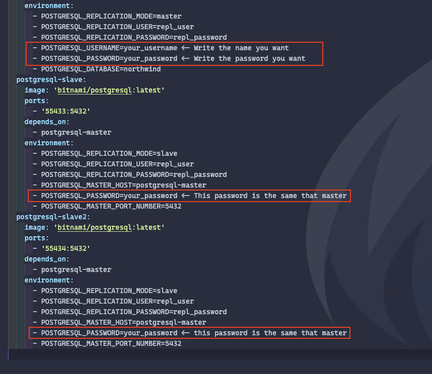
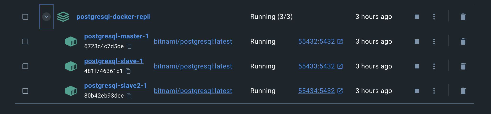
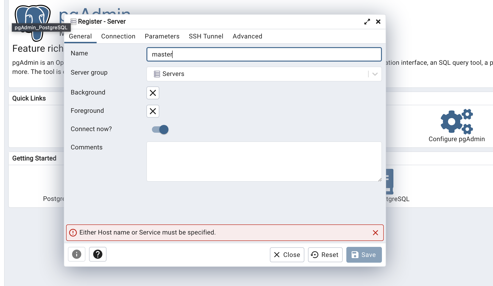
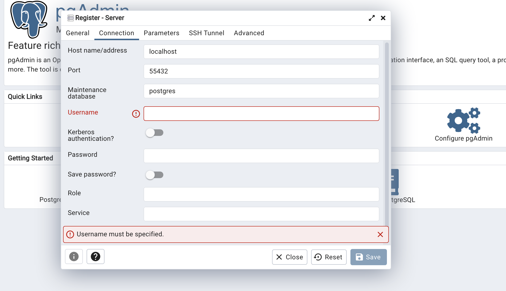
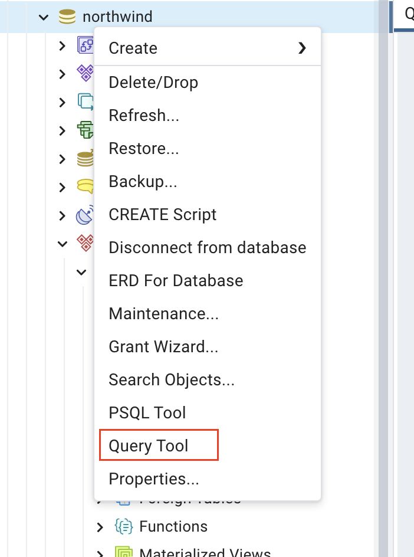
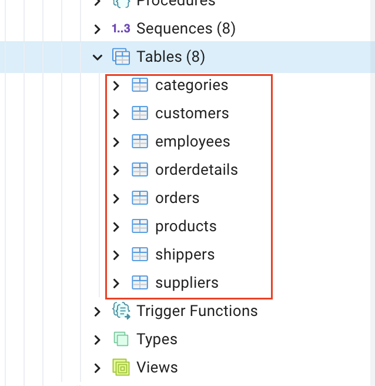
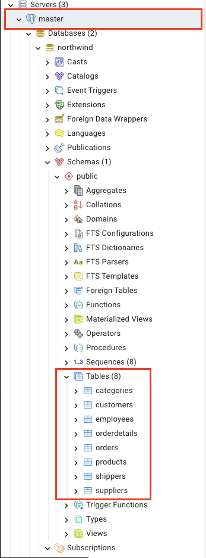
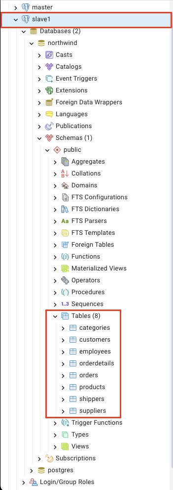
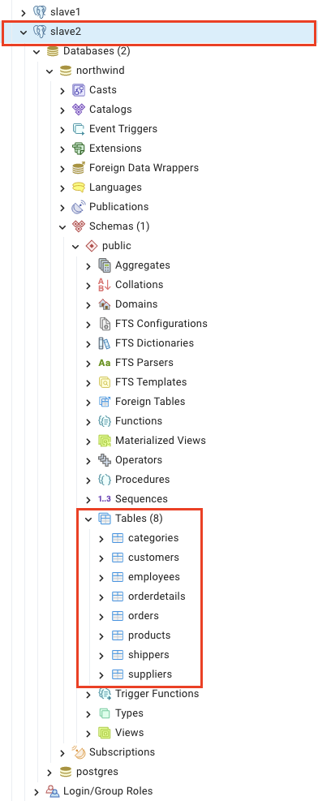

# 🐘PostgreSQL - Replication📚

## Tools we need⚙️

If you don't have this tools you can download them.

- **[Docker](https://www.docker.com)**
- **[PostgreSQLImage](https://hub.docker.com/r/bitnami/postgresql)**
- **[PgAdmin](https://www.postgresql.org/download/)**
- **[VsCode](https://code.visualstudio.com/)**

## Before start

In docker compose file you have change the follow fields.

## Steps for replication🚀

1. Open Docker Desktop.
2. Open folder in VsCode.
3. Open docker-compose.yml.
4. Open an integrated terminal in VsCode and run 'docker compose up --build' command.
   In docker desktop you should watch the master, slave1 and slave2 running.  
   
5. Open **PgAdmin**.
6. Click on "Server".
7. Click on "Add new Server". You will see a window like this
   
8. Write the name as "master".
9. Connection steps.  
   9.2. click on Connection. It show you a panel like this.
     
   9.3. Hostname/addres -> localhost.  
   9.4. Port -> 55432
   9.5. Username -> POSTGRESQL*USERNAME.  
   9.6. Password -> POSTGRESQL_PASSWORD.  
   \*\*\_Note:*\*\* POSTGRESQL_USERNAME & POSTGRESQL_PASSWORD are the parameters in master, you can see in docker compose file.
10. Click on "Save".

## Add slaves⛓️

1. Click on "Server".
2. Click on "Add new server".
3. Write the Name as 'Slave1'.
4. Click on connection.
5. Hostname/address -> localhost.
6. Port -> 55433.
7. Username -> repl_username (You can change it in docker-compose file).
8. Password -> repl_password (You can change it in docker-compose file).
9. Click on "Save".

For add a second slave, you have change the Name as "Slave2" and Port -> 55434.
Hostname/address, username and password is the same like Slave1.

## Adding database script📝

When we created the master, northwind database was created but this database
doesn't have information or tables created.
We are going to add the script from northwind.sql

1. Right click on "master".
2. Click on "Query Tool".  
   
3. Open northwind.sql file from vscode.
4. Copy the script and paste in Query Tool panel in PgAdmin.
5. Run script.
6. Refresh master. You will see the tables added.
7. Click on "Schemas" -> Public -> tables.  
   

---

When you create a new table in master, that table will be replicate in slave1
slave2.

**If you followed the steps, you should see the follow.**

